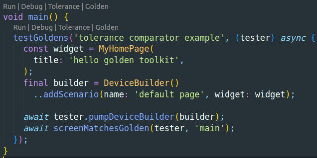

# custom_comparator

Flutter example app to experiment custom golden test file comparator.

## Getting Started

This project is a starting point for a Flutter application.

A few resources to get you started if this is your first Flutter project:

- [Lab: Write your first Flutter app](https://docs.flutter.dev/get-started/codelab)
- [Cookbook: Useful Flutter samples](https://docs.flutter.dev/cookbook)

For help getting started with Flutter development, view the
[online documentation](https://docs.flutter.dev/), which offers tutorials,
samples, guidance on mobile development, and a full API reference.

## Purpose

Flutter golden tests are great. But sometimes, your teammates may have different operating system or your CI does not run on the exact same OS version or variant. This can lead to different golden files being generated.

See [flutter/flutter#56383](https://github.com/flutter/flutter/issues/56383) for more information.

This project is an example of how to use a custom comparator to compare golden files with a little tolerance percentage.

## How to use

### 1. Using the tolerance comparator

Flutter golden file comparator can be overriden using the top level property `goldenFileComparator`. By default this property is a `LocalFileComparator` instance.

This repository contains the `ToleranceComparator` class that can be used to compare golden files with a tolerance percentage. See [tolerance_comparator.dart](test/custom_comparator/tolerance_comparator.dart).

To use it, you can override the `goldenFileComparator` property in your test file:

```dart

import 'package:flutter_test/flutter_test.dart';
import 'custom_comparator/tolerance_comparator.dart';

main() {
  goldenFileComparator = toleranceComparator;
  
  testWidgets('MyWidget', (tester) async {
    await tester.pumpWidget(MyWidget());
    await expectLater(find.byType(MyWidget), matchesGoldenFile('my_widget.png'));
  });
}

```

To specify the tolerance percentage, add `--dart-define=golden_tolerance=0.1` to your test command. The default value is `0.0`.

Value of 1 represents 1% of the image bytes. So a value of 0.1 means that 0.1% of the image size can be different.

```bash
flutter test --dart-define=golden_tolerance=0.1
```

### 2. Configure using flutter_test_config

You can also configure the tolerance percentage via the `flutter_test_config.dart` file. This file is automatically loaded by the `flutter_test` package.

```dart
# flutter_test_config.dart
import 'package:flutter_test/flutter_test.dart';
import 'custom_comparator/tolerance_comparator.dart';

Future<void> testExecutable(FutureOr<void> Function() testMain) async {
    setupAll() {
        goldenFileComparator = toleranceComparator;
    }

    await testMain();
}

```

### 3. Using Golden Toolkit

[Golden Toolkit](https://pub.dev/packages/golden_toolkit) is a package that provides a set of utilities to make it easier to work with golden files. It also provides a `GoldenToolkitConfiguration` class that can be used to configure the tolerance percentage.

```dart
# flutter_test_config.dart
import 'dart:async';

import 'package:flutter_test/flutter_test.dart';
import 'package:golden_toolkit/golden_toolkit.dart';

import 'custom_comparator/tolerance_comparator.dart';

Future<void> testExecutable(FutureOr<void> Function() testMain) async {
  return GoldenToolkit.runWithConfiguration(
    () async {
      goldenFileComparator = toleranceComparator;
      await loadAppFonts();
      await testMain();
    },
    config: GoldenToolkitConfiguration(
      defaultDevices: const [
        Device.phone,
        Device.iphone11,
        Device.tabletPortrait,
        Device.tabletLandscape,
      ],
      enableRealShadows: true,
    ),
  );
}

# test/golden_toolkit_test.dart
import 'package:custom_comparator/main.dart';
import 'package:golden_toolkit/golden_toolkit.dart';

void main() {
  testGoldens('tolerance comparator example', (tester) async {
    const widget = MyHomePage(
      title: 'hello golden toolkit',
    );
    final builder = DeviceBuilder()
      ..addScenario(name: 'default page', widget: widget);

    await tester.pumpDeviceBuilder(builder);
    await screenMatchesGolden(tester, 'main');
  });
}

```

See [golden_toolkit_test.dart](test/golden_toolkit_test.dart) and [flutter_test_config.dart](test/flutter_test_config.dart) for a complete example.

### 4. Using the Visual Studio Code

You can define custom runtime configuration in Visual Studio Code to run your tests with a custom tolerance percentage.

> 💚 Thanks to 💚
> 
> [golden_toolkit documentation](https://pub.dev/packages/golden_toolkit#configure-vs-code) 
>
> 🚀 for this tip 🚀

```json
# .vscode/launch.json
{
  "version": "0.2.0",
  "configurations": [
    {
      "name": "Tolerance",
      "request": "launch",
      "type": "dart",
      "args": [
        "--dart-define=golden_tolerance=0.1"
      ]
    }
  ]
}
```

This `Tolerance` runner can be used directly inside your test code to run your tests with a tolerance percentage of 0.1%.

